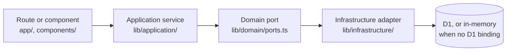
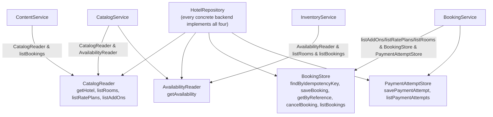
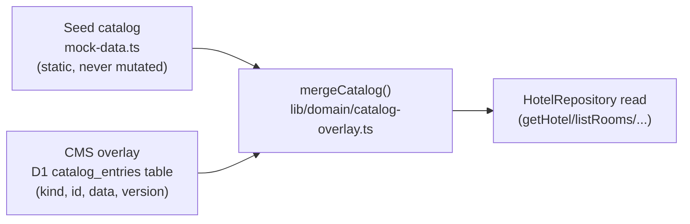

# Architecture

The mental model in five minutes, plus a map of where things live. For the reasoning behind each
decision, TECH.md is the deep reference; this page is the fast one.

## The layers

Every guest-facing flow and every admin write goes through the same four layers, in the same
order, never skipping one:

- **Routes and components** (`app/`, `components/`) render UI and call a service — a server
  action, or an `app/api/*` route handler. They never read seed data or D1 directly, and never
  compute a price themselves.
- **Application services** (`lib/application/`) hold the business rules: `CatalogService`
  (search, offers, facets), `BookingService` (idempotency, price recheck, the hold, persistence),
  `ContentService` (every CMS rule — slugs, concurrency, media, what can be deleted),
  `InventoryService` (the floor plan, the tape chart, who's in which room).
- **Domain ports** (`lib/domain/ports.ts`) are interfaces: `HotelRepository` and its four
  narrower slices, `CatalogContentPort`, `BookingEngineAdapter`, `PaymentProvider`, `CrmAdapter`,
  `PmsAdapter`, `RoomSearchInterpreter`, `Clock`. A service depends on a port, never on a concrete
  implementation.
- **Infrastructure** (`lib/infrastructure/`) implements the ports: D1-or-in-memory repositories,
  mock adapters, the OpenAI adapters (or a keyword-only fallback with no key). **Only
  `lib/application/container.ts` is allowed to import from here** — it's the composition root,
  the one place that decides which concrete implementation a service actually gets.

If you're adding a new business rule and you're not sure where it goes: if it's "what happens
when," it's a service in `lib/application`. If it's "what shape is this," it's a Zod schema in
`lib/domain/schemas.ts`. If it's "how do I ask an external system for this," it's a port method
plus a mock and (maybe) a real adapter.

## One `HotelRepository`, four slices a service can ask for

`HotelRepository` is what every backend (in-memory, D1, the durable overlay wrapper) implements in
full. A service doesn't take the whole thing, though — it takes only the slice it actually calls,
so its constructor signature documents its own dependency:

`Clock` (`lib/domain/ports.ts`, real implementation `lib/domain/clock.ts`) is the same idea for
"now": `BookingService` and `ContentService` take one as an optional constructor parameter
(default the real clock), so a unit test can pass a fixed date.

## The catalog: seed plus a CMS overlay, never a rewrite

The room/rate/add-on **catalog** — names, prices, descriptions — is always static seed data
(`lib/infrastructure/mock-data.ts`) underneath. `/admin/content` never rewrites it. An edit is a
row in one D1 table, keyed by `(kind, id)`; a row whose id the seed already has *replaces* that
entity when read, a new id is a new entity.

`mergeCatalog` is pure and shared by both backends, so a D1-backed read and an in-memory read can
never disagree about the result. "Reset demo state" on `/admin` clears the whole overlay table —
the catalog just falls back to seed.

Bookings, payment attempts, admin overrides, and inventory holds are durable state, not catalog —
they live in their own D1 tables (`bookings`, `booking_units`, `payment_attempts`,
`room_status_overrides`, `inventory_holds`), resolved *at call time*, never cached at module scope
(an `env` binding from `cloudflare:workers` is only reliable once a request is in flight).
`npm run dev` runs against a real, locally emulated D1 database by default (see README's Quick
start) — no separate setup needed. If no D1 binding resolves for some reason, the same read/write
functions fall back to a process-local in-memory store with the same shape, which is what keeps
the app running (state just doesn't survive a restart) rather than failing outright.

## Where things live

| I'm looking for… | It's in… |
|---|---|
| A Zod schema, or a type inferred from one | `lib/domain/schemas.ts` |
| A business rule about money | `lib/domain/pricing.ts` — `buildPriceBreakdown` is the *only* function that produces a total. Nothing else computes one, not a component, not a service. |
| A business rule about dates or availability | `lib/domain/availability.ts` (`resolveRemaining`, `stayBucket`), `lib/domain/dates.ts` (`addIsoDays`) |
| Physical rooms, numbering, who's in which room | `lib/domain/room-units.ts` (`buildRoomUnits`, `allocateRoomType`) |
| A CMS rule (slugs, concurrency, media, what can be deleted) | `lib/application/content-service.ts` |
| The booking flow's own rules (idempotency, recheck, hold) | `lib/application/booking-service.ts` |
| The floor plan or the tape chart | `lib/application/inventory-service.ts` |
| A port interface | `lib/domain/ports.ts` |
| A D1-or-in-memory choice for a port | `lib/infrastructure/durable-hotel-repository.ts`, `durable-catalog-content.ts` |
| The one place infrastructure gets wired up | `lib/application/container.ts` |
| A guest route's UI | `app/` (routes) and `components/` (`hotel/`, `rooms/`, `booking/`, `search/`, `site/`) |
| An admin screen's UI | `app/admin/**`, `components/admin/**` (`shell/` = the back-office chrome, `content/` = CMS form pieces, `tape-chart/` and `operations/` = the PMS-style views) |
| Shared API route boilerplate | `app/api/_lib/http.ts` (`parseJsonBody`, `mapBookingError`, `toBookingErrorResponse`) |
| A shared client hook | `components/site/use-scroll-lock.ts`, `use-overlay-transition.ts`; `components/admin/content/use-ordered-list.ts`, `use-undoable-toggle.ts` |
| Design tokens and rules | `app/globals.css` (tokens), DESIGN_SYSTEM.md (rules) |

## Four rules that don't bend

1. **`lib/application/container.ts` is the only module that imports `lib/infrastructure`.** A
   component or a service never imports a D1 module, a mock adapter, or `mock-data.ts` directly —
   it takes what it needs as a constructor parameter, wired once in the container.
2. **All money goes through `buildPriceBreakdown`.** The catalog card, the room detail summary,
   the booking review, and the booking engine's quote all call it. A component computing its own
   total from line items is always a bug, never a feature.
3. **Business rules live in `lib/application`, never in a component or a server action.** A
   server action's job is: parse the input, call a service, map the result. If you find yourself
   writing an `if` that decides whether something is *allowed*, it belongs in a service.
4. **Zod is the runtime contract boundary.** Every server action, API route, and CMS form parses
   its input through a schema in `lib/domain/schemas.ts` (or a schema built from one) before
   touching a service. TypeScript strict mode catches the static half of this; Zod catches the
   part that only exists at request time.

## Next

- **New here?** Read ONBOARDING.md next — it walks one booking through every layer above.
- **Building something specific?** HOWTO.md has recipes for the common first tasks.
- **Debugging something?** TROUBLESHOOTING.md has the traps this codebase has already hit.
